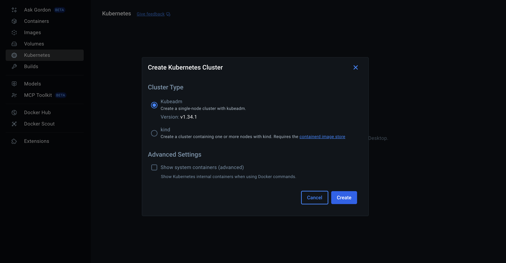

# 本地運行 k8s

準備一種可以在本地運行的 k8s 方案（例如 docker-desktop or kind or minikube）

驗證方式: 透過 kubectl get pod 查看是否有回傳結果

## 用 docker-desktop

打開 Docker Desktop 的設定，啟用 Kubernetes


選擇預設的設定


安裝完成後會看到 Kubernetes 已經啟動


## 安裝 kubectl

```bash
brew install kubectl
kubectl version --client
```

## 驗證

```bash
# 使用 Docker Desktop 的 context
kubectl config use-context docker-desktop

=> Switched to context "docker-desktop".
```

```bash
# 看 nodes 是否就緒
kubectl get nodes

=> NAME             STATUS   ROLES           AGE     VERSION
   docker-desktop   Ready    control-plane   9m44s   v1.34.1
```

```bash
# 看系統命名空間的 Pod
kubectl get pods

=> No resources found in default namespace.
```

執行 `kubectl get pods` 時因為沒有 `pods` 所以沒有任何回傳結果
