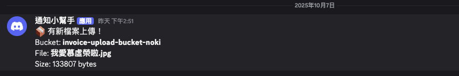
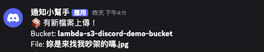

# Lambda 監聽 S3 上傳檔案

嘗試使用 lambda 實作，在圖片上傳 S3 bucket 時，通知使用者的功能（打 discord），以通知會計人員有單據上傳。

## 手動操作

### 建立 S3 Bucket

1. 前往 AWS Console → S3 → Create bucket
2. Bucket name：invoice-upload-bucket-noki

### 建立 Lambda Function

1. 前往 AWS Console → Lambda → Create function
   選項：

    - Author from scratch
    - Function name：NotifyDiscordOnUpload
    - Runtime：Node.js 20.x
    - Role：選擇「Create a new role with basic Lambda permissions」

2. 點「Create function」

### 編輯 Lambda Function

把這段程式碼

```javascript
import https from "https";

const DISCORD_WEBHOOK_URL = "xxxxxx"; // 換成你自己的網址

export const handler = async (event) => {
    console.log("Received event:", JSON.stringify(event, null, 2));

    for (const record of event.Records) {
        const bucket = record.s3.bucket.name;
        const key = decodeURIComponent(record.s3.object.key.replace(/\+/g, " "));
        const size = record.s3.object.size;

        const message = `📦 有新檔案上傳！\nBucket: **${bucket}**\nFile: **${key}**\nSize: ${size} bytes`;

        await sendDiscordMessage(message);
    }

    return {
        statusCode: 200,
        body: JSON.stringify("Notification sent to Discord!"),
    };
};

function sendDiscordMessage(content) {
    return new Promise((resolve, reject) => {
        const data = JSON.stringify({ content });

        const url = new URL(DISCORD_WEBHOOK_URL);

        const options = {
            hostname: url.hostname,
            path: url.pathname + url.search,
            method: "POST",
            headers: {
                "Content-Type": "application/json",
                "Content-Length": Buffer.byteLength(data),
            },
        };

        const req = https.request(options, (res) => {
            res.on("data", () => {});
            res.on("end", () => {
                console.log("Discord response:", res.statusCode);
                resolve();
            });
        });

        req.on("error", (e) => {
            console.error("Error sending to Discord:", e);
            reject(e);
        });

        req.write(data);
        req.end();
    });
}
```

放到 Lambda 的 code editor 裡，並按下「Deploy」來部署。

### 設定 Lambda 觸發器

1. 在 Lambda function 頁面，點選「Add trigger」
2. 選擇 S3
3. 選擇剛剛建立的 S3 bucket（invoice-upload-bucket-noki）
4. Event type 選擇「All object create events」
5. 點「Add」

### 測試

1. 前往 S3 bucket（invoice-upload-bucket-noki）
2. 點「Upload」並上傳一個檔案
3. 檢查 Discord 頻道，應該會收到通知



## [使用 terraform](./lambda-s3-discord/)

### 新增以下幾個檔案

-   lambda-s3-discord/
    -   main.tf # AWS provider + region
    -   lambda.tf # IAM Role、Lambda Function、S3 Notification
    -   lambda.mjs # Lambda 程式碼
    -   variables.tf # 定義 Discord webhook 變數
    -   terraform.tfvars # 放 Discord webhook URL（不上傳）

### 執行

```bash
terraform init
terraform plan -var-file="terraform.tfvars"
terraform apply -var-file="terraform.tfvars"
```

### 驗證是否成功

到 aws console 的 s3 上傳檔案，並查看 discord 是否有收到通知。
有收到通知就代表成功。


