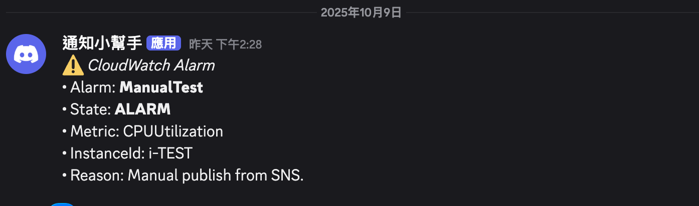
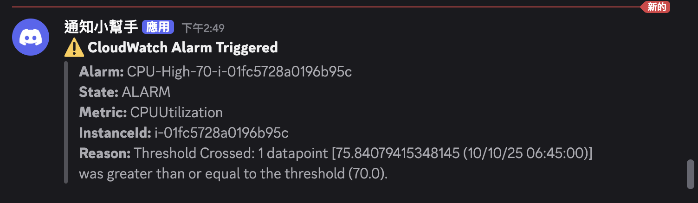

# Cloudwatch 監控方案

## 什麼是 metrics、log、trace

-   Metrics: 目前系統的健康狀況，例如 CPU 使用率、記憶體使用量等。
-   Logs: 系統發生的事件紀錄，例如錯誤訊息、系統啟動等。
-   Traces: 因為一個請求可能跨越多個服務，Trace 用來追蹤這個請求的整個路徑。

## 用實作暸解監控

使用 AWS 的 Cloudwatch 來實作監控方案。

### 手動

#### 建立 EC2

-   Name: cloudwatch-demo
-   AMI: Amazon Linux 2
-   Instance type: t2.micro
-   Key pair: 選擇或建立新的 key（用於 SSH）

#### 在 EC2 上安裝 CloudWatch Agent

CloudWatch 預設只能監控 CPU 使用率。
要監控 記憶體與磁碟，需安裝 CloudWatch Agent。

##### SSH 登入 EC2

```bash
ssh -i your-key.pem ec2-user@your-ec2-public-ip
```

###### 安裝 CloudWatch Agent

```bash
sudo yum install -y amazon-cloudwatch-agent
```

##### 建立 CloudWatch Agent 配置檔案

```bash
sudo /opt/aws/amazon-cloudwatch-agent/bin/amazon-cloudwatch-agent-config-wizard
```

##### 啟動 CloudWatch Agent

```bash
sudo systemctl start amazon-cloudwatch-agent
sudo systemctl enable amazon-cloudwatch-agent
```

確認運作狀態

```bash
sudo systemctl status amazon-cloudwatch-agent
```

過程中如果看到 `Active: inactive (dead)` 可能是設定檔有誤或 IAM 權限不足，我先用指令手動啟動 agent

```bash
sudo /opt/aws/amazon-cloudwatch-agent/bin/amazon-cloudwatch-agent-ctl \
  -a fetch-config \
  -m ec2 \
  -c file:/opt/aws/amazon-cloudwatch-agent/bin/config.json \
  -s
```

但出現

```bash
Configuration validation succeeded
amazon-cloudwatch-agent has already been stopped
```

看起來設定檔沒錯，但還是沒啟動

執行這個指令

```bash
sudo /opt/aws/amazon-cloudwatch-agent/bin/amazon-cloudwatch-agent-ctl \
  -a start \
  -m ec2 \
  -c file:/opt/aws/amazon-cloudwatch-agent/bin/config.json
```

看到 `Active: active (running)` 就表示成功啟動

#### 在 CloudWatch 查看 Metrics

但在 CloudWatch 的 Metrics 頁面沒看到 `CWAgent`
先確認 agent 有沒有成功上傳資料

```bash
sudo tail -n 20 /opt/aws/amazon-cloudwatch-agent/logs/amazon-cloudwatch-agent.log
```

會有錯誤訊息

```bash
NoCredentialProviders: no valid providers in chain
EC2RoleRequestError: no EC2 instance role found
EC2MetadataError: failed to make EC2Metadata request
status code: 404
```

CloudWatch Agent 已啟動，但無法上傳監控資料到 CloudWatch，
因為它沒有 AWS 權限（缺 IAM Role）。

##### 讓 EC2 擁有 IAM Role

1. 進入 AWS Console => IAM => Roles => Create role
2. 選：
    - Trusted entity type: AWS Service
    - Use case: EC2
3. 點「Next」
4. 在權限頁面搜尋並勾選：
    - CloudWatchAgentServerPolicy
5. 下一步 => 命名： CloudWatchAgentRole

##### 將 IAM Role 指派給 EC2

1. 進入 AWS Console => EC2 => Instances
2. 點上方「Actions => Security => Modify IAM Role」
3. 選剛剛建立的 `CloudWatchAgentRole`

##### 重啟 CloudWatch Agent

```bash
sudo systemctl restart amazon-cloudwatch-agent
```

接下來確認狀態

```bash
sudo systemctl status amazon-cloudwatch-agent
```

看是否有上傳資料

```bash
sudo tail -n 20 /opt/aws/amazon-cloudwatch-agent/logs/amazon-cloudwatch-agent.log
```

出現這些訊息就表示成功

```
"msg":"Everything is ready. Begin running and processing data."
"msg":"ec2tagger: Initial retrieval of tags succeeded"
"msg":"ec2tagger: EC2 tagger has started, finished initial retrieval of tags and Volumes"
```

##### 回到 CloudWatch 查看 Metrics

看是否有出現 `CWAgent` 這個 namespace

#### 建立 CloudWatch Dashboard

1. 到 CloudWatch => Dashboards => Create dashboard 名稱：`EC2-Monitor-Dashboard`
2. 建立三個 Widget
    - CPU
        - Namespace: AWS/EC2 => Metric: CPUUtilization
    - Memory
        - Namespace: CWAgent => Metric: mem_used_percent
    - Disk
        - Namespace: CWAgent => Metric: disk_used_percent => 維度選 `ImageId, InstanceId, InstanceType, device, fstype, path`，再選 `path=/`

#### 建立 SNS + Lambda + Discord

##### 建立 SNS Topic

在 `SNS → Topics → Create topic`

-   Name: `cw-cpu-alerts`
-   Type: Standard

##### 建立 Lambda Function

1. 進 Lambda → Functions → Create function

    - Name：cwAlarmToDiscord
    - Runtime：Node.js 20.x
    - Architecture：x86_64（預設）
    - Permissions：Create a new role with basic Lambda permissions → Create function

2. 進 Function → Configuration → Environment variables → Edit → Add

    - Key：DISCORD_WEBHOOK_URL
    - Value：貼 webhook URL → Save

3. 進 Code → mjs，貼上以下程式碼，並 Deploy

```javascript
// index.mjs
import https from "https";

const postToDiscord = (url, body) =>
    new Promise((resolve, reject) => {
        const u = new URL(url);
        const req = https.request(
            {
                hostname: u.hostname,
                path: u.pathname + u.search,
                method: "POST",
                headers: { "Content-Type": "application/json" },
            },
            (res) => {
                let d = "";
                res.on("data", (x) => (d += x));
                res.on("end", () => resolve({ status: res.statusCode, data: d }));
            }
        );
        req.on("error", reject);
        req.write(JSON.stringify(body));
        req.end();
    });

export const handler = async (event) => {
    const url = process.env.DISCORD_WEBHOOK_URL;
    const sns = event?.Records?.[0]?.Sns;
    const msg = sns ? JSON.parse(sns.Message) : event;

    const alarmName = msg.AlarmName || "UnknownAlarm";
    const state = msg.NewStateValue || "ALARM";
    const reason = msg.NewStateReason || "";
    const metric = msg.Trigger?.MetricName || "CPUUtilization";
    const instanceId = msg.Trigger?.Dimensions?.find((d) => d.name === "InstanceId")?.value || "-";

    const content = `⚠️ CloudWatch Alarm
• Alarm: **${alarmName}**
• State: **${state}**
• Metric: ${metric}
• InstanceId: ${instanceId}
• Reason: ${reason}`;

    const res = await postToDiscord(url, { content });
    console.log("Discord response:", res);
    return { statusCode: 200, body: "ok" };
};
```

##### 建立 SNS Topic 並訂閱 Lambda

1. 進 SNS => Topics => Create topic

    - Type：Standard
    - Name：cw-cpu-alerts => Create topic

2. 進剛建立的 cw-cpu-alerts => Create subscription

    - Protocol：AWS Lambda

    - Endpoint：選 cwAlarmToDiscord => Create subscription

##### 建立 CloudWatch CPU Alarm（目前的 Alarms 頁）

1. Select metric：

    - 依序 EC2 => Per-Instance Metrics => 找 CPUUtilization
    - 勾選自己創的 EC2（InstanceId 對到那台安裝了 CWAgent 的機器）=> Next

2. Conditions：

    - Statistic：Average
    - Period：1 minute
    - Threshold type：Static
    - Greater than or equal to 70
    - Datapoints to alarm：2 out of 2（要更敏感可 1/1）→ Next

3. Notification：

    - Select an SNS topic => 選 `cw-cpu-alerts` => Next

4. Name and description：
    - Alarm name：CPU-High-70-< InstanceId> => Next => Create alarm

#### 驗證

1. 回到 EC2，模擬高 CPU 使用率

```bash
yes > /dev/null &
```

2. 看 CPU 是否上來

```bash
top -d 1
```

3. 接下來看 Discord 是否有收到告警訊息
   

4. 有看到就成功了，把模擬高 CPU 的指令關掉

```bash
pkill yes # 或 kill 指令
```

### [使用 Terraform](./cloudwatch-tf/)

使用 Terraform 自動化建立 CloudWatch 監控方案。

#### 拆成以下檔案：

-   `ec2.tf`: 建立 EC2 + IAM Role（附 CloudWatchAgentServerPolicy）
    -   建立 EC2 實例作為被監控的目標，並透過 IAM Role 賦予 EC2 權限，讓 CloudWatch Agent 能夠將監控數據（記憶體、磁碟使用率）上傳到 CloudWatch
-   `cloudwatch.tf`: 建立 Metrics、Dashboard、Alarms
    -   設定監控項目（CPU、記憶體、磁碟）、建立視覺化儀表板以及告警規則，當資源使用率超過閾值時觸發告警
-   `lambda.tf`: 建立 Lambda + 環境變數 + SNS subscription
    -   建立 Lambda 函數作為告警通知的處理器，接收來自 SNS 的告警訊息並轉發到 Discord，讓團隊能即時收到系統異常通知
-   `sns.tf`: 建立 SNS topic + policy
    -   建立 SNS 主題作為告警的中間層，CloudWatch Alarm 會發送告警到 SNS，SNS 再觸發 Lambda。這種設計讓告警通知更靈活，未來可輕鬆新增其他訂閱者（如 Email、SMS）
-   `variables.tf`: 定義變數
    -   集中定義可重複使用的變數（如 region、instance_type、Discord webhook），提高程式碼的可維護性和重用性
-   `lambda/index.mjs`: Lambda 程式碼
    -   實作告警訊息的格式化與發送邏輯，將 CloudWatch 的 JSON 格式告警轉換為易讀的 Discord 訊息
-   `terraform.tfvars`: 變數值
    -   儲存實際的變數值（如 Discord webhook URL、SSH key name），這個檔案通常不應提交到版本控制中（已加入 .gitignore），避免洩漏敏感資訊

#### 執行

1. 初始化

```bash
terraform init
```

2. 預覽

```bash
terraform plan
```

3. 建立資源

```bash
terraform apply -auto-approve
```

#### 驗證

1. SSH 登入 EC2

```bash
ssh -i xxxx.pem ec2-user@your-ec2-public-ip
```

2. 模擬高 CPU

```bash
yes > /dev/null &
```

3. Discord 收到警報訊息



4. 恢復 CPU

```bash
pkill yes
```
